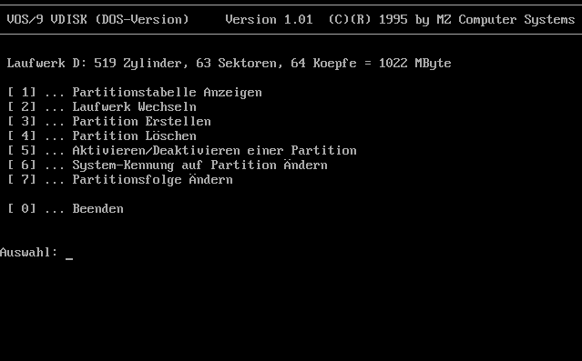
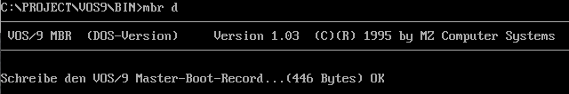
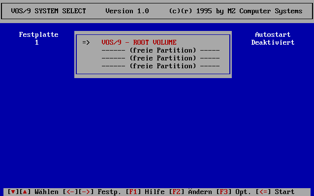
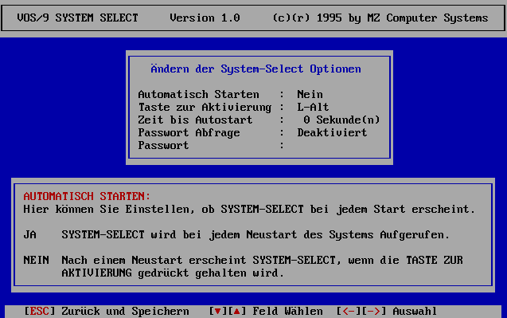
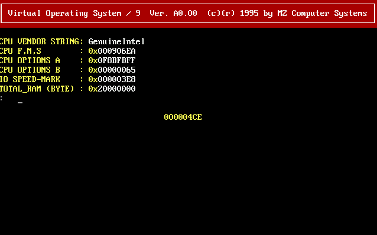

# VOS/9

## Learn assembly by building your own Operating System

# About

Have you ever wondered how to learn assembly language or how an operating system works? Then maybe this is the place you'll quickly find your answers.

I've learned assembly by writing my own operating system and some early results of this journey is what you'll find here. This was a very long time ago when I was at school and unfortunately I lost most of the code over the years. What's left is still from a very early stage, but that's what makes it even better as easy understandable learning material. You will find plenty of source code for operating systems online (see for example the Linux kernel source code [[kernel.org](kernel.org)], but the huge code base does not necessarily make it easy to learn basic functions from it. Therefore I decided to put the still fully functional code online for interested people.

# A brief history

 [Microsoft DOS](https://en.wikipedia.org/wiki/MS-DOS) was still the widespread OS at the time I started and I missed the great features of my [Commodore Amiga](https://en.wikipedia.org/wiki/Amiga#Commodore_Amiga) which was so much superior to anything the PC world had to offer. Programming languages were BASIC, C, Pascal and Assembly. Intel just came up with the "protected mode" on it's 386 CPU, an exciting new thing. While coding I often got annoyed by having to press the reset button (yes, PC's had a reset button for good reasons) whenever I messed up something. These new CPU features and my curiosity got me thinking. The result was that the idea for a multi tasking OS (like I got used to on my amiga) with the ability to run other OS instances in some kind of sandbox. Basically what we know as virtualization technology today and therefore the name "virtual operating system" (yes, kind of a confusing name ;).

The Internet and networking in general wasn't known or available to most people but there was [Novell Netware](https://en.wikipedia.org/wiki/NetWare) which offered a network filesystem with incredible features (still true from todays perspective) and a central user rights management. This was my main inspiration for the filesystem design. Not sure what I had in mind with this filesystem because most of these features would be kind of an overkill for my intended functionality but I guess I just wanted to learn from the best. I've never implemented the full functionality but it was fun to think about all the possibilities. So I hope that you too will have a lot of fun with this little fun project.

# Components

## VDISK.EXE

This tool is similar to the fdisk command for partitioning disks but has some extended features like changing partition order and creating a partition for VOS/9.

The syntax is: VDISK.EXE &lt;DRIVE-LETTER&gt;

Note that it doesn't matter if DOS recognized the drive. VDISK converts the letter to the corresponding BIOS identifier (A=0x0h, B=0x1h, C=0x80h, D=0x81h, ...).

Point of interest: vdisk\vdisk.pas

## MBR.EXE

MBR writes a [master boot record](https://en.wikipedia.org/wiki/Master_boot_record) to a disk. The syntax is: MBR.EXE &lt;DRIVE-LETTER&gt; (where drive letter has the same logic as with VDISK). The master boot record is the first sector an a disk and holds the partitioning data as well as a tiny program responsible for locating and loading the operating system.

Point of interest: boot\mbr.pas, boot\bootsec.asm

## SYSTEM SELECT

System select is the boot loader which gets loaded from the VOS/9 partition by the MBR code and is responsible for loading the actual OS. It includes a boot manager which comes up when keeping the ALT key pressed on boot (you need to be quick on a virtual machine):

It is the equivalent to the job [grub](https://www.gnu.org/software/grub/) does for linux systems or the windows boot loader. You can select the partition to boot from (in case you have multiple operating systems installed on your disk), rename a partition entry, set a password or other options by pressing F3:

SYSTEM SELECT will boot the first active partition if you don't keep the ALT key pressed. 

Point of interest: boot\sys_sel.asm, filesys\makeroot.asm, boot\vosboot.asm

## KERNEL

Unfortunately this is the part where most of my code got lost with the years but it makes things much easier to understand. 

There is nothing more than a prompt and a counter visible but the code to get there is quite interesting because the initialization of the intel x86 architecture is the same with every OS:

Creating a minimal [Global Descriptor Table](https://en.wikipedia.org/wiki/Global_Descriptor_Table) (GDT). The GDT is a data structure which describes various memory areas and their characteristics, called segments. We're defining a video, kernel code and a data segment which must exist before being able to switch into [protected mode](https://en.wikipedia.org/wiki/Protected_mode).

The next structure required is the [task state segment](https://en.wikipedia.org/wiki/Task_state_segment) (TSS). This structure holds information about a task such as the processor register state, I/O permissions and stack pointer. Without a task structure the CPU would have no information about what to execute and the result would be an exception.

Finally we need an [interrupt descriptor table](https://en.wikipedia.org/wiki/Interrupt_descriptor_table) (IDT). This structure tells how to respond to interrupts and exceptions. We are capturing the most important interrupts like the final double fault in which case we show a kernel panic, which is the analog to the same on Linux or a blue screen in Windows. The [Intel 64 and IA-32 Architectures Software Developer's Manual](https://www.intel.com/content/dam/support/us/en/documents/processors/pentium4/sb/25366821.pdf) provides a great resource on these thing.

Most parts of the code are dealing with basic functions like learning about the hardware, accepting keyboard input and video output which was easy with the help from the BIOS but at this point we have to deal with this on our own.

Point of interest: kernel\vos9.asm and its includes.

# Prerequisites

## MS DOS

You will need a virtual (or physical o:) machine with MS DOS. As far as I know it can be used for free in the meantime and you'll find plenty of read to run virtual machine images (just google MS-DOS VHD for a Hyper-V image). Note that some DOS versions don't include the [EXE2BIN](https://en.wikipedia.org/wiki/Exe2bin) program, which is required to build the source. In case this is missing, you'll find an open source version by asking google.

## Borland Turbo Assembler and Turbo Pascal

You'll find copies of [Borland Turbo Assembler](https://en.wikipedia.org/wiki/Turbo_Assembler) (TASM) for DOS on many sites for download. The product was discontinued with version 5.4 in 2010. It is listed on the [Embarcadero antique software archive](https://edn.embarcadero.com/article/20803) which states "These historical files are provided to the Borland community free of charge. They may be downloaded and used "as is" for personal use only.".

Make sure all the tools are in your path. 

# Compiling

Extract the source in \PROJECT\VOS9 (or adjust the Makefile if you choose a different path) and run 

`make all`

on the projects root folder. The output is copied to the BIN\ folder. VDISK.EXE is not built automatically. Switch to the VDISK folder and run `tpc vdisk.pas` to build the executable (see known issues at the end!). 

# Quick start

### Create a partition

Add a tiny new disk (ide device) to your virtual machine. This will be recognized by the BIOS as drive D (0x81h). Run `VDISK.exe D` and make sure you have selected the correct disk. Select option 3 to create a new partition. You will be asked if you would like to reserve the whole space for VOS/9. Select yes. From the main menu select option 5 to activate the partition. This is required for the boot loader to know here to look for an operating system.

### Write the master boot record

Switch to the \BIN directory and run MBR.EXE D to write the master boot record.

### Create the filesystem and install the OS

From the \BIN directory run MAKEROOT.EXE. This will ask for the drive number the VOS/9 partition is located on. Note that this expects the BIOS drive number as decimal number. So for the first disk is 128 (0x80h) and our second drive D is 129 (0x81h) and so on,

The next question is about the block size to use in kbyte (4 is a reasonable choice).

# Known issues

## vdisk.exe Run Time Error 200
You may run into Run Time Error 200 (Divide by Zero) after compiling the code.
This is caused by a bug in older versions of Turbo Pascal and Borland Pascal compilers 
(version 6 and earlier) within the CRT.ASM code. See [https://www.kennedysoftware.ie/patchcrt.htm]
for a tool to patch the compiled .exe if you don't have access to a newer pascal compiler version.

# Books

I'd like to highly recommend two books I loved at this time. Most likely they will be hard to get but they are very well written and up until today nothing really changed on these fundamental parts.

The undocumented PC: A Programmer's Guide to I/O, CPUs, and Fixed Memory Areas, Frank Van Gilluwe (ISBN 978-0201622775)

German: Intel's i486 Architektur und Befehlsbeschreibung der xxx86er-Familie, Wolfgang Matthes (ISBN 3-928051-29-6)

 

# Feedback

I would be very happy to hear from you if this was of any help :)

# License

The code is licensed under the MIT License (the "License").

